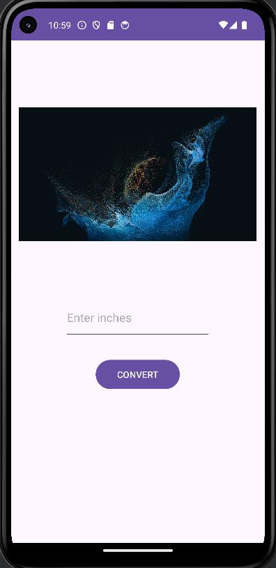
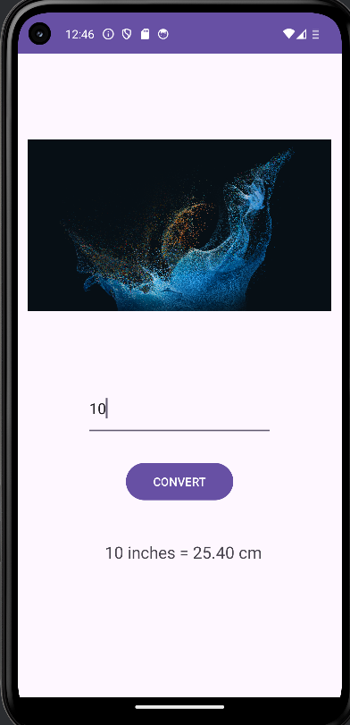

# 📏 Inches to Centimeters Converter App

A simple Android application built using **Kotlin** and **Android Studio** that converts inches into centimeters instantly with a clean and user-friendly interface.

## 🚀 Features

- Convert inches to centimeters instantly
- Simple and intuitive user interface
- Input validation
- Fast and lightweight application
- Beginner-friendly Android project
- Built using Kotlin and XML

## 📱 App Screenshots

<table>
<tr>
<td align="center">
<b>Home Screen</b><br>

</td>

<td align="center">
<b>Conversion Example</b><br>

</td>

<td align="center">
<b>Another Example</b><br>

</td>
</tr>
</table>

## 📖 How It Works

1. Enter a value in inches.
2. Tap the **Convert** button.
3. The app calculates the equivalent value in centimeters.
4. The result is displayed instantly.

## 📐 Conversion Formula

```text
Centimeters = Inches × 2.54
```

### Example Conversions

| Inches | Centimeters |
|---------|------------|
| 10 | 25.4 cm |
| 25 | 63.5 cm |
| 50 | 127 cm |

## 🛠️ Built With

- Kotlin
- Android Studio
- XML Layouts
- Android SDK
- Material Design Components

## 📂 Project Structure

```text
Inches-to-Centimeters-app
│
├── app
│   ├── src
│   │   ├── main
│   │   ├── java
│   │   ├── res
│   │   └── AndroidManifest.xml
│   └── test
│
├── screenshots
├── README.md
└── build.gradle.kts
```

## 🎯 Learning Objectives

This project was created to practice:

- Android Activity Lifecycle
- Kotlin Programming
- User Input Handling
- Button Click Events
- XML Layout Design
- Android Studio Development Workflow

## ⚙️ Installation

1. Clone the repository

```bash
git clone https://github.com/Dipti-Choubey-101/Inches-to-Centimeters-app.git
```

2. Open the project in Android Studio.

3. Sync Gradle files.

4. Run the application on an emulator or physical Android device.


## 📄 License

This project is licensed under the MIT License.

## 👨‍💻 Author

**Dipti-Choubey**

GitHub: https://github.com/Dipti-Choubey-101
